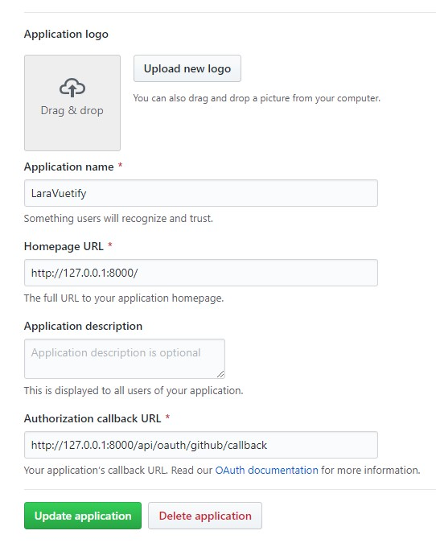
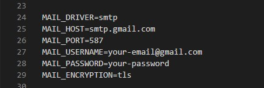

## LaraVuetify ##

Laravel + Vuetify starter template

[](https://travis-ci.org/jioo/laravuetify) [](http://paypal.me/jjquiazon)

This Project is based on 
- [cretueusebiu/laravel-vue-spa](https://github.com/cretueusebiu/laravel-vue-spa)
- [creativetimofficial/vuetify-material-dashboard](https://github.com/creativetimofficial/vuetify-material-dashboard)

### Prerequisite ###
1. Install Composer [https://getcomposer.org/download/](https://getcomposer.org/download/)
2. Install Node.js [https://nodejs.org/en/download/](https://nodejs.org/en/download/)
3. Download any supported database provider: [https://laravel.com/docs/5.7/database](https://laravel.com/docs/5.7/database)

### Installation ###
```bash
# Copy the example env file and make the required configuration changes in the .env file
cp .env.example .env

# Install all composer dependecies
composer install

# Generate a new application key
php artisan key:generate

# Generate a new JWT authentication secret key
php artisan jwt:secret

# Run the database migrations --set the database connection in .env before migrating--
php artisan migrate --seed

# Install node dependecies
npm i
```

### Run ###
- **Admin** account:
    - email: `admin@gmail.com`, password: `123456`
- **User** account:
    - email: `jdoe@gmail.com`, password: `123456`

```bash
# Start the local development server: http://127.0.0.1:8000
php artisan serve

# build and watch
npm run watch
```

### Test ###
```bash
# Run Feature tests
./vendor/bin/phpunit
```

### Production ###
```bash
npm run production
```

### Tips ###
1. To enable login with github, make a New OAuth App and copy this configuration: 

2. To send email in `Reset Password` module: 
    - Update the email config in .env file with your gmail account
    
    - Allow your account to less secure app access
    
3. Run `php artisan config:cache` after updating your .env file. 
4. It's recommended to have a clean database before seeding. You can refresh your migrations at any point to clean the database by running `php artisan migrate:fresh --seed`

### Features ###

* Laravel 5.7
* [Laravel-Permission](https://github.com/spatie/laravel-permission)
* Socialite integration
* Login, register and password reset
* Pages with dynamic import and custom layouts
* Authentication with JWT
* Vue + VueRouter + Vuex + VeeValidate 
* [Vuetify Material Design](https://github.com/creativetimofficial/vuetify-material-dashboard)
